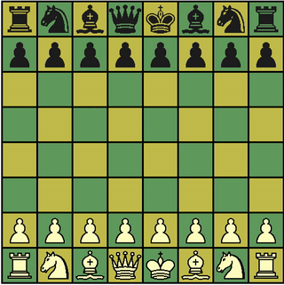
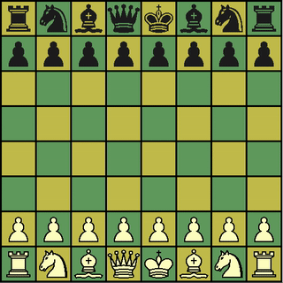
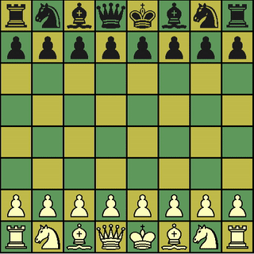

# Readme

This was my undergraduate A.I. project.
Just standard C++ so it compiles with just:

`g++ tal.cpp -o tal`

It's a Chess engine built to interface with WinBoard.
It receives the game state from the GUI, and returns a
move for the computer to make.

### In Action!

I had saved PGNs from various stages of progress.
You can kind of see it advance in skill here. The
original PGNs (and a few more) are in the repo.

1. Early stages (Yay move generation working!)

2. I think this was before the Q-values for pieces
on particular squares was added. It just does dallies
until challenged.

3. This next game is from four days later, it think
I fixed some bugs with the Alpha Beta search and added
piece square tables.

4. It managed to find a checkmate because I wasn't paying
attention!

### How to Play

1. Compile and get the binary `tal`
2. Get WinBoard, and place the engine in its own folder along with the other included engines (should be easy to locate).
3. Modify the config file to allow choosing this engine as an option. It's a text file and the list is easy to locate because it includes the names of other engines (whose folder names you see during step 2).
4. Start playing and have fun! I would love to hear feedback.
